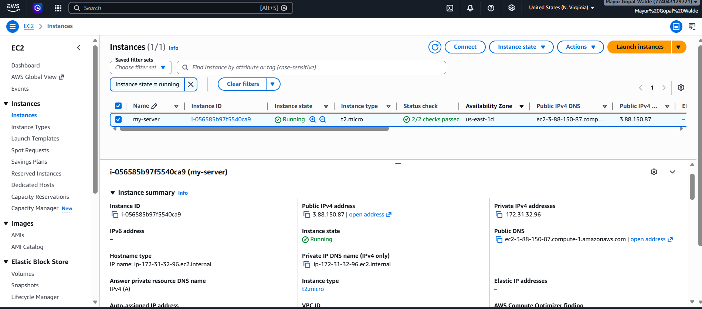
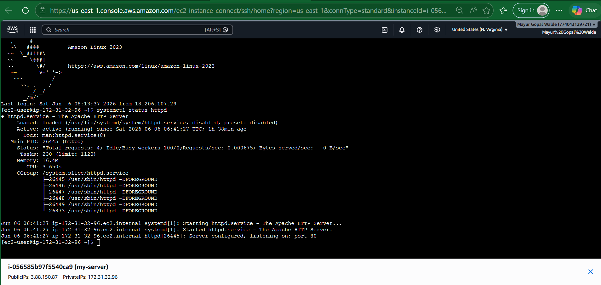
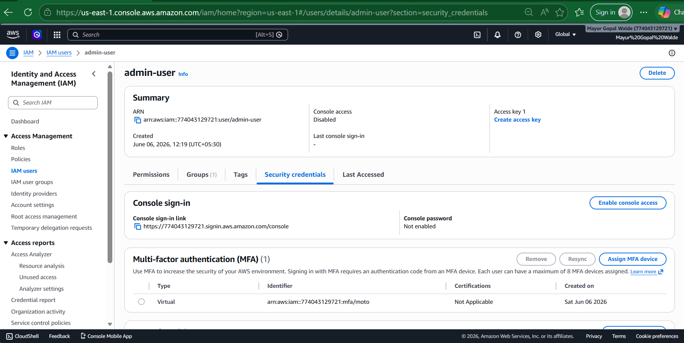

Markdown

##LIVE PROJECT STATUS: COMPLETED
  AWS Hands-on Experience Verified

# AWS Cloud Portfolio

##  Name: Mayur Walde
##  Location: Mumbai,India
##  Role: Cloud Support Engineer / System Administrator

---

# ABOUT ME
IT Support Engineer with hands-on experience in system administration and AWS cloud basics. Built multiple real AWSprojects including EC2, IAM, and S3 to demonstrate prsctical cloud skills.

---

## CLOUD PROJECTS
---
### EC2 Linux Web Server Deployment
- Launched Amazon Linux EC2 instance
- Configured security  groups (SSH + HTTP)
- Installed Apache web server
- Hosted static website

Markdown
- EC2 instance running screenshot 
##Evidence

Markdown

Markdown

EC2 Linux server deployed and web hosting Configured
Markdown

--

## S3 Static Website Hosting
- Created S3 bucket
- Enabled static website hosting
- Upload HTML files
- Configured public access

proof:- Evidence:

Markdown

Markdown

Markdown

Markdown

Markdown

S3 static website hosted with public access and policy Deployed
http://my-aws-site-2205.s3-website-us-east-1.amazonaws.com/

---

## IAM Security Setup
- Created Admin & Readonly users
- Assigned IAM policies
- Enabled MFA authentication
- Tested access control (role-based access)

proof:- Evidence
IAM users, roles and MFA security Verified and tested
AWS Identity and Access Management
Markdown

Markdown
.png)

Markdown

--

# Skills
- AWS (EC2, IAM, S3)
- Linux basics
- Network fundamentals
- Cloud security basics

---

# GOAL
To become a Cloud Support Engineer and grow into Cloud / DevOps roles.

---

# PROJECT PROOF
- Bucket created and files uploaded
- Static website hosting enabled
- Public access configured
- Bucket policy applied
- Website successfully accessible via endpoint URL

# KEY LEARNING
- AWS EC2 deployment lifecycle
- IAM role-based access control (RBAC)
- S3 static website hosting
- Linux server management basics
